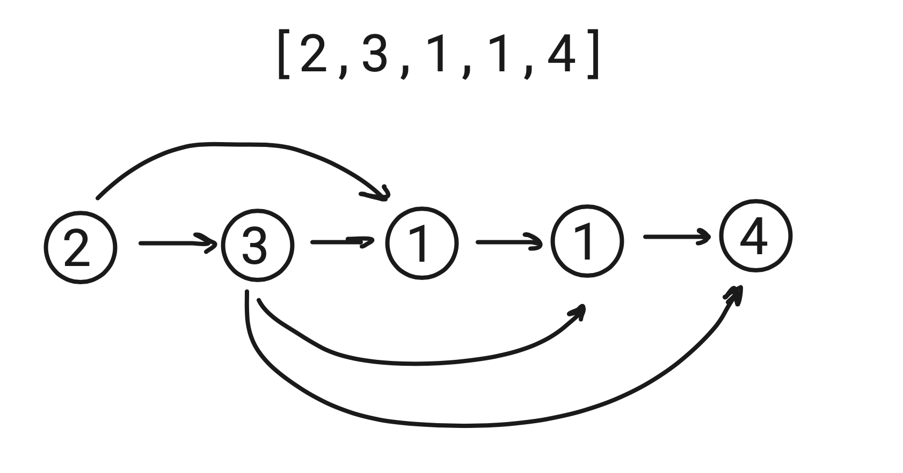

# Jump Game

## Intuition

- I see ***Jump Game*** as a type of a ***Dynamic Programming*** problem where no ***subproblem solving*** is required.
- We can construct a ***Direct Acyclic Graph*** like this:

### Node Relationship

- ***A -> B*** means we can ***jump from node A to node B***.

## Solution

- I termed Jump Game as a Dynamic Programming problem because ***we determine if we can jump to the Goal node from the current node, and if we can - the current node becomes the goal***. If our goal node is the first node, we arrived from the last node to the current node.