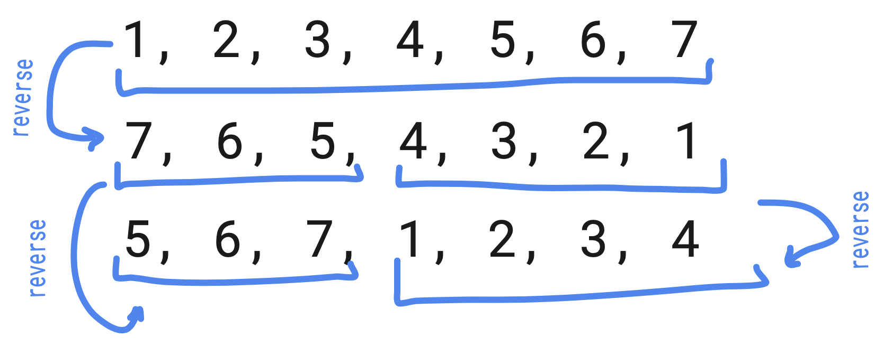

# Rotate Array

## Ain't no philosophy here, just a simple trick to remember

- To ***rotate an array by k steps***, we need to do these ***3 steps***:
  - Reverse the ***whole array***.
  - Reverse the ***first k elements subarray***.
  - Reverse ***rest of the elements subarray***.
  

## Complexity
- Time: ***O(N)***
- Space: ***O(1)***