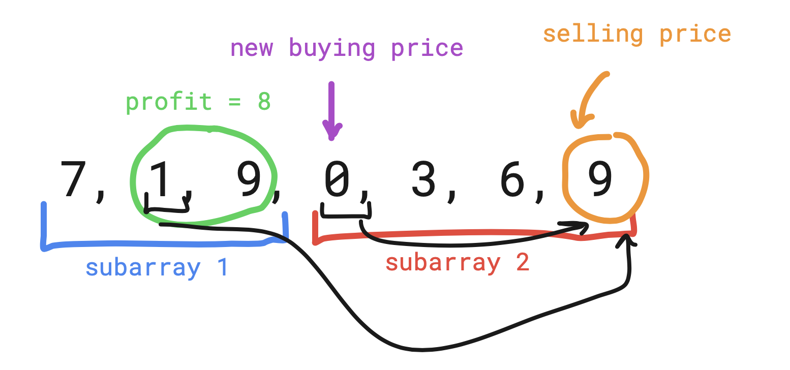

# Kadane's Algorithm

- **Problem**: Find the ***maximum sum of a subarray***.

---

## Intuition

- If we traverse through the array and add all elements to a **sum** and the **sum** is **negative**, it will only lower our sum in the future. It's better to ***start from zero*** than to start from a negative value.

## Implementation

    public static int maxSubArray(int[] nums) {

            int currentMax = nums[0];
            int globalMax = nums[0];
    
            for (int i = 1; i < nums.length; i++) {
                currentMax = Math.max(nums[i], currentMax + nums[i]);
                globalMax = Math.max(globalMax, currentMax);
            }
    
            return globalMax;

    }

## Best Time to Buy and Sell Stock: Variation of Kadane's Algorithm

- If we find a better(lower) buying price, that is our new buying price. That is the start of our ***new subarray***.
- It may be possible that the ***best profit*** was located in the ***previous subarray***, but we know for sure that if we find a lower buying price the profit will be bigger, and we ***may or may not find a better profit***.
  

- As you can see from the picture above, it's better to buy at the price of ***0*** the at the price of ***1*** ,since we are going to ***arrive at the selling price of 9 with either of the buying prices***.