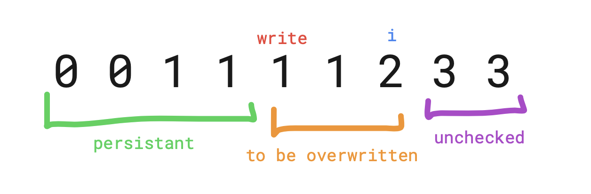

# Pattern #1: Write Pointer

## Intuition

- We need to modify an array ***in place***.
- We want to ***filter out*** elements from the array.
- First ***k*** elements in the resulting array are elements that are left after filtering. The rest are not important.

## Logic

- We have a ***write pointer*** that ***overwrites*** elements that should be ***filtered out*** with an element that we want to ***persist*** after filtering.
- We have a ***scan pointer*** that ***checks if the element should be filtered out*** - on the ***right*** of the scan pointer are ***unchecked*** elements.
- We can think of it like this - on the ***left side of the write pointer*** are elements that ***persist***.
- ***Between*** write pointer and scan pointer are elements that are going to be ***filtered out***.

## Complexity
- Time: **O(N)**
- Space: **O(1)**
## Visual Example 

- Here is an example from the problem: [***80.Remove Duplicates from Sorted Array II***](https://leetcode.com/problems/remove-duplicates-from-sorted-array-ii/):

    
